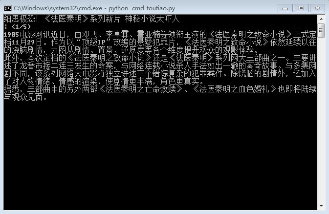

# cmd-toutiao
#### 摸鱼神器：在命令行中看今日头条

### What is this?

这是一个在可以在cmd中看今日头条的家伙，上班时间也可以偷偷看了！

特性：

- 支持今日头条推荐入口的新闻

- 支持新闻溯源

- 单条标题显示，感兴趣的可以查看新闻内容

  

### Requirements：

- python 3.7+
- keyboard
- beautifulsoup4

依赖见 requirements.txt

### How to use：

1. 克隆项目

   > git clone https://github.com/handong0123/cmd-toutiao.git

   > cd cmd-toutiao/

2. 安装依赖

   > pip install -r requirements.txt

3. 运行程序

   > 打开cmd ， 进入项目目录/src
   >
   > python cmd_toutiao.py

如果你没有环境，请移步[此处](https://github.com/handong0123/cmd-toutiao/releases/tag/1.0)下载exe直接运行

##### 操作：

方向键控制：下键切换新闻，左键查看内容，右键溯源

### Citing

如果你有更好的建议，请建issue，大家一起讨论

如果你对代码有丰富，请提PR

如果有重大的提交，我会将您加入作者列表

### Authors

handong970123@gmail.com

免责说明：此项目为非营利性项目，没有商业用途，仅供学习使用。